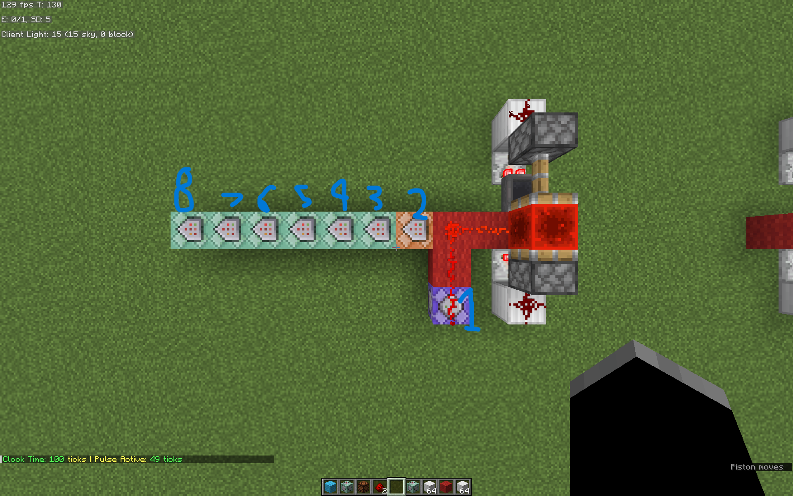
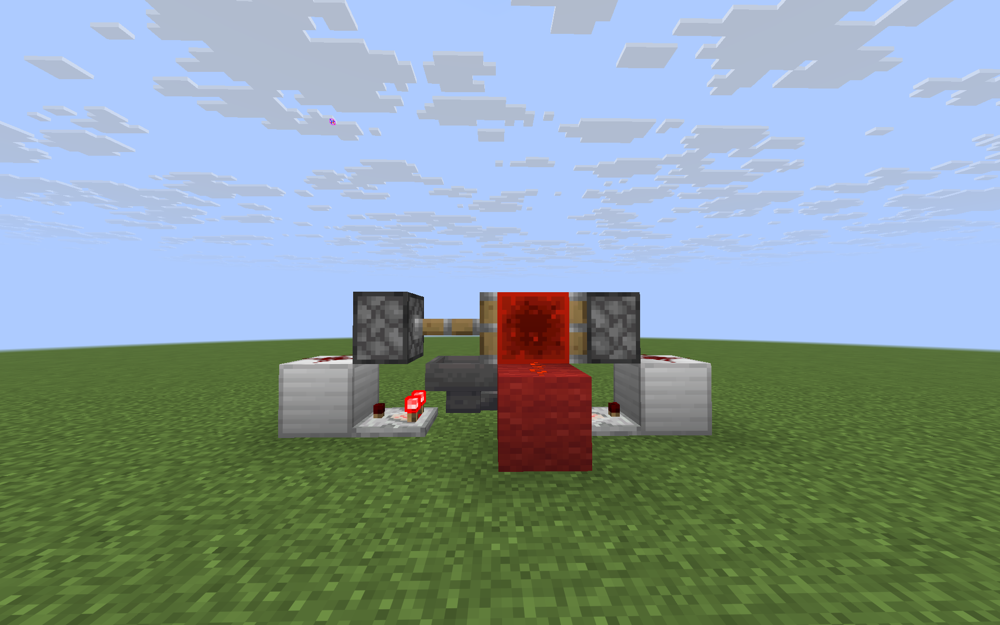
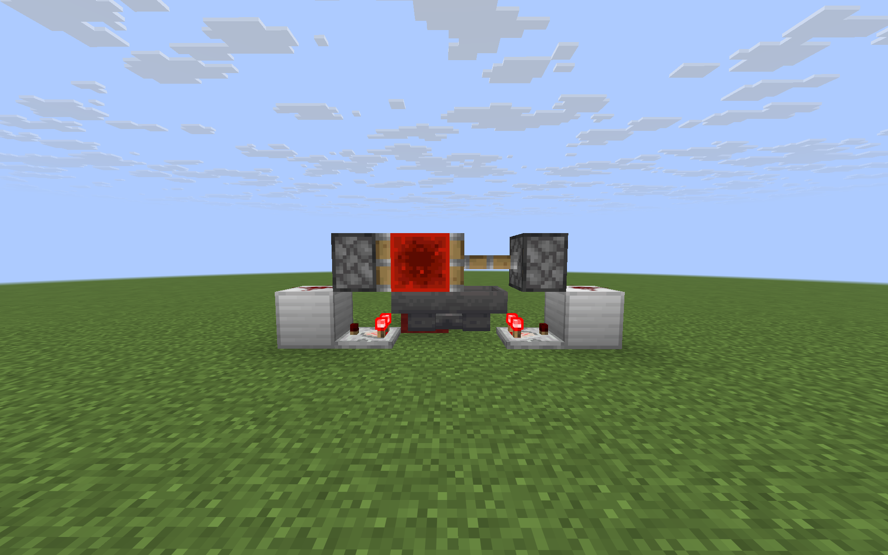
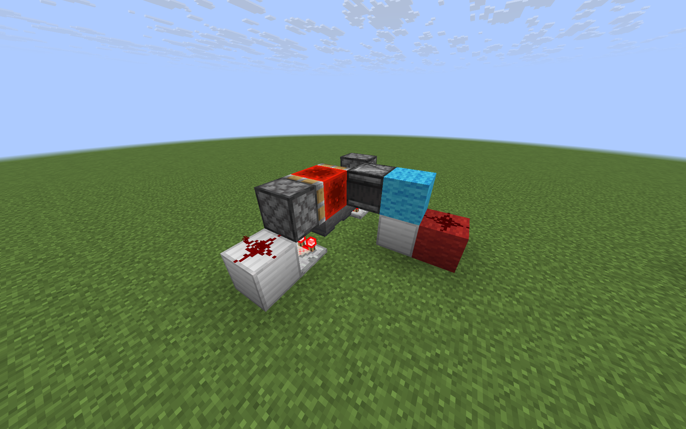
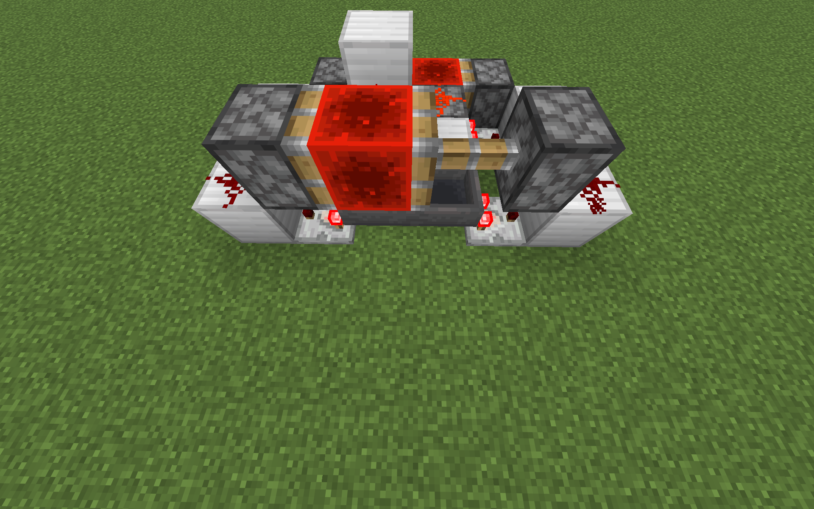
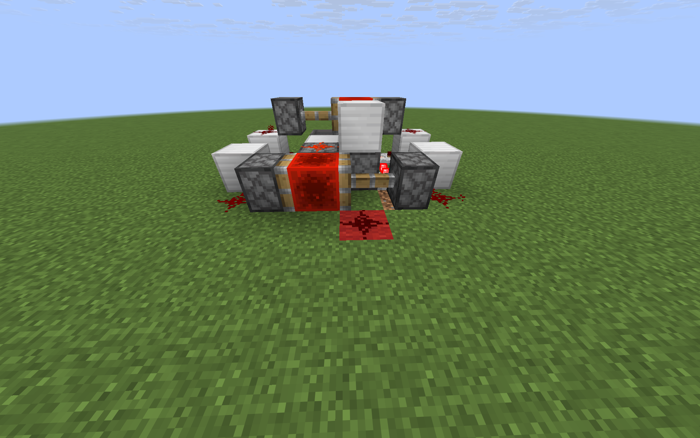
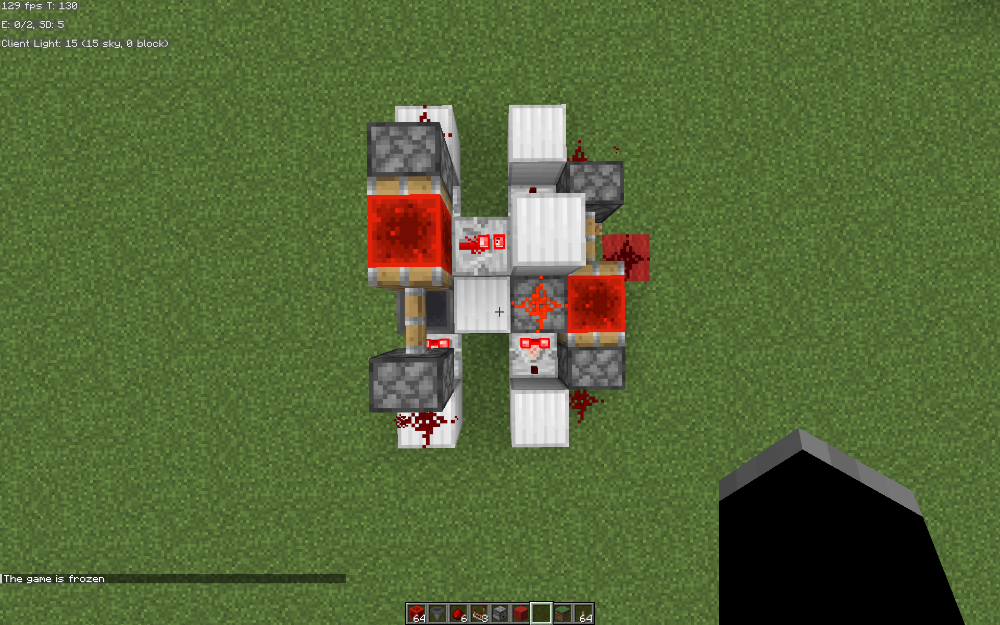

# Methods

Clock time is defined as the time(in game ticks) between the start of one pulse and the start of the next pulse of the output. 
Method for precise measurement was using these command blocks: 

   1. Repeat/Unconditional/Needs Redstone. connected to output of clock `/scoreboard players add #pulse_duration timer 1`
   2. Impulse/Unconditional/Needs Redstone. connected to output of clock `/scoreboard players add #toggle click_count 1`
   3. Chain/Unconditional/Always Active; `/execute if score #toggle click_count matches 1 store result score last_time timer run time query gametime`
   4. Chain/Unconditional/Always Active; `/execute if score #toggle click_count matches 2 store result score current_time timer run time query gametime`
   5. Chain/Unconditional/Always Active; `/execute if score #toggle click_count matches 2 run scoreboard players operation current_time timer -= last_time timer`
   6. Chain/Unconditional/Always Active; `/execute if score #toggle click_count matches 2 run tellraw @a [{"text":"Clock Time: ","color":"green"},{"score":{"name":"current_time","objective":"timer"}},{"text":" ticks | Pulse Active: ","color":"yellow"},{"score":{"name":"#pulse_duration","objective":"timer"}},{"text":" ticks"}]`
   7. Chain/Unconditional/Always Active; `/scoreboard players set #pulse_duration timer 0`
   8. Chain/Unconditional/Always Active; `/execute if score #toggle click_count matches 2 run scoreboard players set #toggle click_count 0`

# Clocks
Red wool is the output of the clock. 
$i$ represents total items when applicable; $t$ represents clock time; $p$ represents pulse duration

## Repeater Clock(4 ticks minimum, infinitely scalable)
Simple and effective for shorter clocks. Needs a 'starting pulse' to get it going. The pulse length will be equal to the starting pulse.
## Etho Hopper Clock Full (0.7-255.4 seconds)
Uses 2 sticky pistons, 2 hoppers, 2 comparators, 1 redstone block, and 2 redstone dust. 

$$
t(i) = 
\begin{cases} 
16i-12 & \text{for } 1 < i \le 320 \\
14 & \text{for } i = 1
\end{cases}
$$

$$
p(i) = 
\begin{cases} 
\frac{t(i)}{2} - 1 & \text{for } 1 \le i \le 320
\end{cases}
$$
Front

Back

## Etho Hopper Clock Halved (0.35-127.7 seconds)
Instead of one long output, like the basic etho hopper clock, it uses an observer to modulate the output, which makes pulse length independent of the clock time, and also halves the clock time.
Uses 2 sticky pistons, 2 hoppers, 2 comparators, 1 redstone block, 2 redstone dust, 1 observer, and 1 optional repeater.
$$
t(i) = 
\begin{cases} 
8i-6 & \text{for } 1 \lt i \leq 320 \\
7  & \text{for } i = 1
\end{cases}
$$

$$
p(i) = 2
$$
(pulse can be easily adjusted by replacing the light blue wool with a repeater)

## Chained Hopper-Dropper Clock (1.4 seconds - 81.728 hrs)
Can fit pretty much any need, at the cost of size. First stage is normal etho hopper clock, second stage is a dropper clock connected to it. You can make the same adjustement with an observer that you can with the etho hopper clock to shorten pulse length. 
Uses 4 sticky pistons, 2 hoppers, 2 droppers, 4 comparators, 2 redstone blocks, 5 redstone dust, 1 repeater.  $i_1$ is the number of items in the hopper clock, and $i_2$ is the number of items in the dropper clock. Model gets funky for 2 or less items, and there is no reason to use this clock in those scenarios.

$$
t(i_1,i_2) = 
\begin{cases} 
32i_1i_2-24i_2 & \text{for } 3 \leq i_1 \leq 320;\quad  3 \leq i_2 \leq 576 
\end{cases}
$$
$$
p(i_1,i_2) = 
\begin{cases} 
\frac{t(i_1,i_2)}{2} - 1 & \text{for } 3 \leq i_1 \leq 320; \quad 3 \leq i_2 \leq 576
\end{cases}
$$
<table>
  <tr>
    <td align="center">
       
      <b></b>
    </td>
    <td align="center">
       
      <b></b>
    </td>
  </tr>
  <tr>
    <td colspan="2" align="center">
       
      <b></b>
    </td>
  </tr>
</table>

# Other
## Algorithm
Most of it is simple, based on the wanted clock time, check which clocks are in that range. Sort by accuracy, and then simplicity. For the chained clock, we also try to minimize the items used, $i_1+i_2$.

$$
t=32i_1i_2-24i_2\\
t=i_2(32i_1-24)\\
i_2=\frac{t}{32i_1-24}\\
\text{minimize } f(i_1)=i_1+\frac{t}{32i_1-24}\\

\frac{d}{di_2}[i_1+\frac{t}{32i_1-24}]=1-\frac{32t}{(32i_1-24)^2}=0\\
32i_1-24=\sqrt{32t}\\
i_1=\frac{\sqrt{2t}}{8} + \frac{3}{4}
$$
